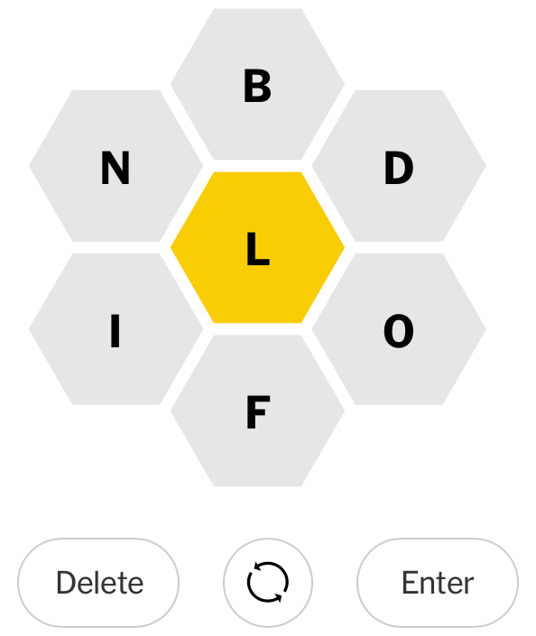

# getNYTSpellingBee
The goal of this code is to solve the New York Times puzzle called "Spelling Bee".  The solution is comprised of a US dictionary from NLTK and a singular regular expression that should obey the rules of the puzzle.

The rules from the New York Times:

"Create words using letters from the hive.
- Words must contain at least 4 letters.
- Words must include the center letter.
- Words may not be proper nouns or hyphenated.
- Letters can be used more than once.

Score points to increase your rating.
- 4-letter words are worth 1 point each.
- Longer words earn 1 point per letter.
- Each puzzle includes at least one “pangram” which uses every letter. These are worth 7 extra points!

New puzzles are released daily at 3:00 a.m. ET."

